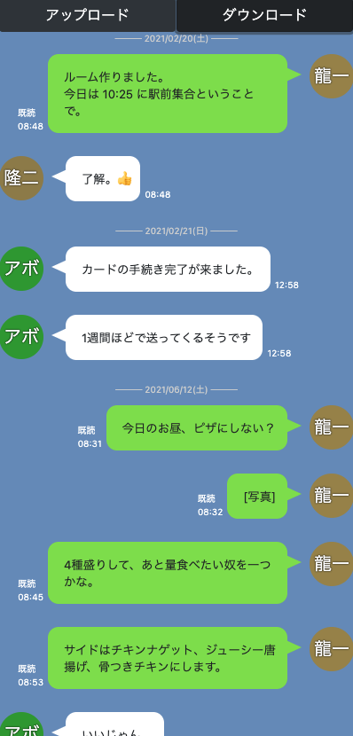

# LINE風LINEバックアップテキストデータビュアー

LINEで「トーク履歴を送信」で取得できる味気ないトーク履歴をLINEのトーク画面風の見た目に変換するWebアプリケーションです。

トーク履歴のテキストファイルをアップロードするとプレビューされるので、「ダウンロード」ボタンを押すと、プレビューされた内容をそのまま単一の HTML ファイルにして保存することができます。

また、アップロードされるのはご利用のブラウザまでで、サーバにトーク履歴が保存されることはありません。

ご利用は http://hidao80.github.io/LINEBackupViewer/ からどうぞ。

※画面は開発中のものです

## ToDo

- [x] デフォルト画面のダウンロード（仮）ができる
- [x] ダウンロードボタンをクックすると、画面に描画されているメッセージをHTMLファイルとしてダウンロードする
- [x] ログのアップロードすると、画面にLINE風に描画する
- [ ] グループLINEのトークで本人を識別する
- [x] 日付の区切りが入る
- [x] 各投稿時刻を表示する
- [x] OS によるフォントとボタンスタイルの違いを統一
